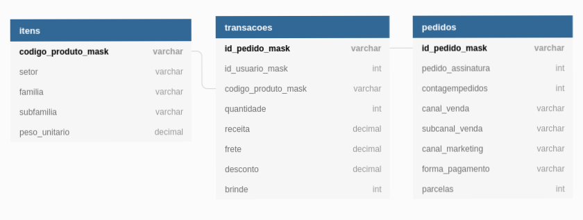

# Teste de Cientista de Dados
As respostas para o teste técnico de cientista de Dados.

## Como Usar o Teste?
O teste foi construído em docker para que seja mais fácil de ser reproduzido. Primeiro passo é dar um git clone e entrar na pasta de container 

```shell
git clone https://github.com/israelmendez232/data-science-test.git
cd data-science-test/container
```

Agora, é rodar pelo essa linha de comando:
```shel
docker-compose up --tag datascience_test_israel_mendes .
```

Após a criação da imagem, saiba que já está rodando o jupyter notebook. Você pode acessar o resultado do teste aqui: [http://localhost:8888/notebooks/container/main_script.ipynb](http://localhost:8888/notebooks/container/main_script.ipynb)

**OBSERVAÇÃO**: tendo em vista que o banco sqlite original não foi colocado dentro do repositório Git para preservar o teste, é sugerido que você coloquem o arquivo `dsci_test.sqlite` na pasta `container` para que possam reproduzir o código de maneira mais fiel.

---

## Modelagem Tabelas

Segue uma modelagem simples das tabelas apresentadas no teste, para que seja mais fácil de entender a relação entre colunas e tabelas. O que ajudou a produzir insights melhores dentro das etapas propostas. A visão das tabelas: <br>

