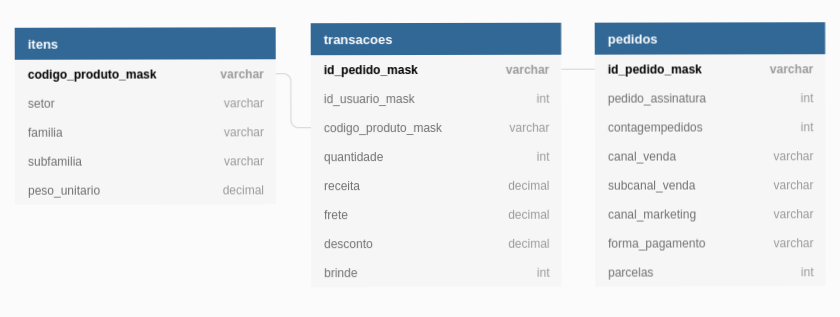

# Data Science Test 
## Technical interview
My response for a technical data science test and position.

- [ ] Main documentation(objectives, to do's)
- [ ] Configure docker container for this code;
- [ ] Modeling visualy the tables;
- [ ] Phase 1: Exploratary Analysis
- [ ] Phase 2: Entendimento das alavancas de receita
- [ ] Phase 3: qual a recomendação que você daria para a Petlove melhorar seu faturamento?
- [ ] Phase 4: Que outros dados, variáveis ou qualquer tipo de informação você adicionaria à este problema para tentar obter melhores resultados na explicação da receita da Petlove?

---

## Docker Imagem
To create the respective image and dependencies:
`docker build --tag datascience_test_israel_mendes .`

Now, run the container from the image created:
`docker run -it -p 8080:8888 datascience_test_israel_mendes`

Access the jupyter notebook on your browser here:
`localhost:8888/tree` or [localhost:8888/tree](localhost:8888/tree)

**OBSERVATION**: remember to add the original `dsci_test.sqlite` on the folder `container`. As this is a test, is important to preserve the orignal database far from this repository.

---

Modeling Table:  
